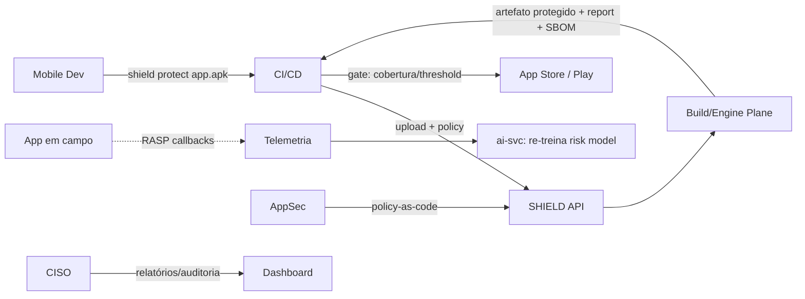

# 01 — Visão Geral

## Objetivo do sistema

SHIELD é uma plataforma de **Mobile Application Shielding** (RASP + Ofuscação + Anti-Tamper + Code Virtualization) para **Android e iOS**, entregue como **SaaS multi-tenant**, **on-premises** e **híbrido**. Opera sobre **binários** (APK/AAB/IPA) — sem código-fonte — aplicando proteções declarativas (*policy-as-code*) e devolvendo um artefato protegido, assinado e auditável.

## Problema resolvido

Apps móveis são distribuídos como binários que rodam em dispositivos não confiáveis (rooted/jailbroken, com Frida/Xposed, emuladores). Isso permite **engenharia reversa, extração de segredos/chaves, adulteração, fraude e pirataria**. Ferramentas nativas (ProGuard/R8) só fazem *shrink+rename* e não resistem a um atacante determinado. SHIELD eleva o custo de reversão/adulteração e adiciona **detecção e reação em runtime**.

## Público-alvo

- **Fintechs, bancos e carteiras digitais** (proteção de fluxos financeiros, PIX, cartão).
- **Governo/defesa** e setores regulados (on-prem air-gapped).
- **Games e mídia/streaming** (anti-pirataria, DRM, proteção de IP).
- **Enterprises** com apps críticos e times DevSecOps.

## Personas

| Persona | Papel | Objetivos | Dores |
|---------|-------|-----------|-------|
| **Ana — AppSec Engineer** | Define políticas de proteção | Proteção *risk-driven*, gates no CI, retrace de crashes | Overhead runtime, falso-positivo de RASP |
| **Bruno — Mobile Dev** | Integra no build | `shield protect` no pipeline sem fricção | Proteção quebrar o app, builds lentos |
| **Carla — DevOps/SRE** | Opera pipelines | Integração CI/CD, self-hosted runner, observabilidade | Segredos, chaves de assinatura |
| **Daniel — CISO** | Governança | Compliance, evidências, SBOM, auditoria | Vazamento de chave, cross-tenant |
| **Eduardo — Product Owner (cliente)** | Contrata | ROI, cobertura vs concorrentes | Custo, onboarding pesado |
| **Fernanda — Platform Admin (SHIELD)** | Opera o SaaS | Tenants, quotas, feeds de defesa | Escala, isolamento |

## Benefícios

- **Defense-in-depth**: camadas independentes com *tripwires* redundantes (P3).
- **Proteção adaptativa por IA**: técnica cara (VM) só onde há risco (*risk map*), minimizando overhead.
- **DevSecOps nativo**: policy-as-code, Terraform provider, gates, retrace automatizado.
- **Feedback loop de campo**: telemetria de ataques reais re-treina o *risk model*.
- **Builds determinísticos e auditáveis** (P2) com SBOM e *provenance* SLSA.

## Diferenciais competitivos

1. Proteção adaptativa dirigida por IA (*risk-driven*).
2. VM **polimórfica por build** (ISA distinta a cada artefato).
3. Reação RASP **distribuída** (elimina o *single point of patch*).
4. DevSecOps de verdade (policy-as-code, provider Terraform, gates).
5. Feedback loop de campo (defesa melhora com ataques reais).

## Casos de uso (visão)

### UC-01 — Proteger um APK no CI
`Bruno` adiciona a action `shield-org/protect-action@v1`; o pipeline sobe o AAB, aplica `prod-high`, recebe artefato + report; o build falha se a cobertura < threshold.

### UC-02 — Definir política risk-driven
`Ana` edita a policy (YAML), o `ai-svc` gera o *risk map*, o Planner concentra virtualização nos *hot spots*.

### UC-03 — Retrace de crash em produção
`Ana` envia stack trace ofuscado; a plataforma usa o `mapping` cifrado para desofuscar.

### UC-04 — Observabilidade de proteção
`Daniel` vê no dashboard quantos devices *rooted/hooked* tentaram rodar o app, por região.

### UC-05 — Deploy on-prem air-gapped
`Carla` instala o Helm chart, importa engine feeds assinados por `.shieldpack`, usa HSM local — nenhum binário sai do perímetro.
