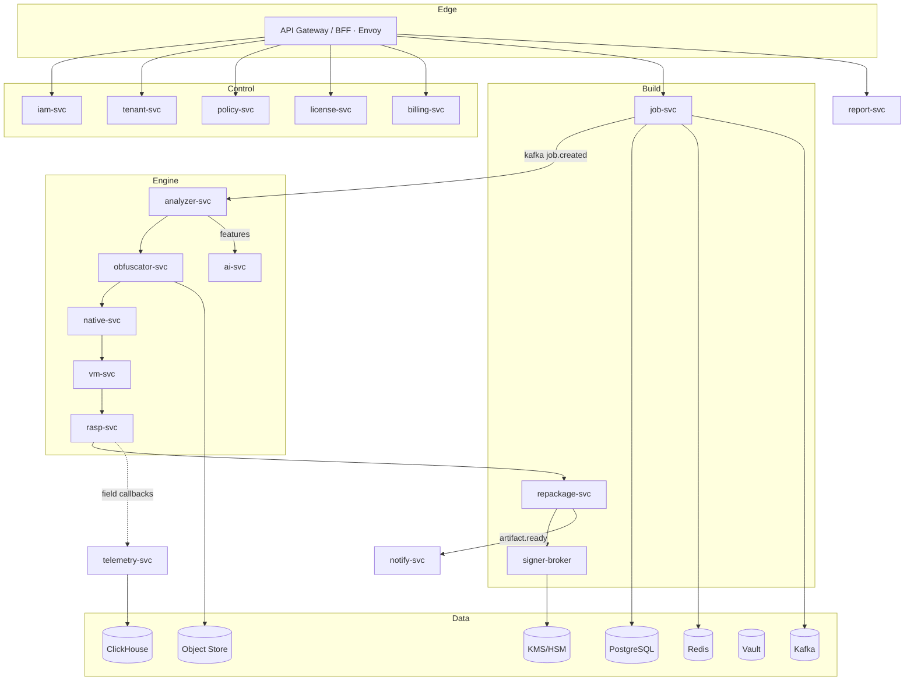
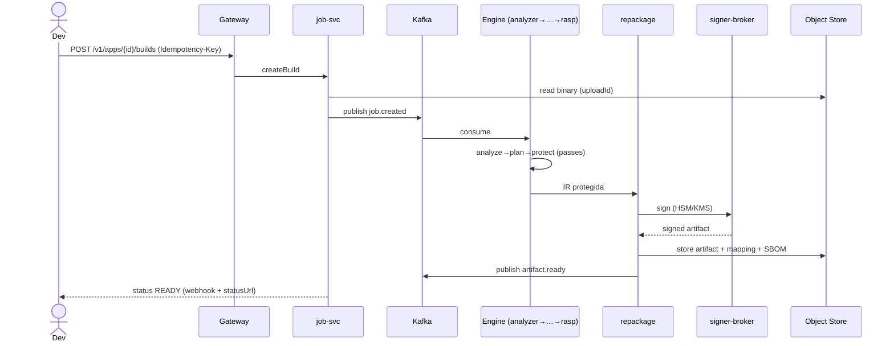
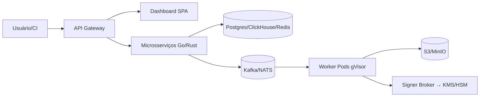

# 04 — Arquitetura

## Estilo arquitetural

| Decisão | Escolha | Justificativa |
|---------|---------|---------------|
| Macro | **Microservices por bounded context (DDD)** + *database-per-service* | Escalar engines (CPU-bound) independente do control plane (I/O-bound); isolamento de falha |
| Comunicação | **Event-driven (Kafka)** + gRPC síncrono onde latência exige | Pipeline longo (minutos) desacoplado da API síncrona |
| Engine interno | **Hexagonal / Ports & Adapters** + pipeline de *passes* | Passes plugáveis sobre a SHIELD-IR; testável |
| Leitura/Escrita | **CQRS leve** no build/telemetria (event-sourcing no `job-svc`) | Reconstrução de histórico/auditoria; retry idempotente |
| Dashboard | **BFF + GraphQL** | Queries compostas, evita over-fetching |

> **Nota (débito estruturante — RESOLVIDO em v0.2.0):** a "SHIELD-IR" era smali-texto (regex). Foi introduzida uma **IR tipada Go-native** (`internal/ir`) — parser estruturado + inferência de tipos + liveness, decisão em [ADR 0001](../adr/0001-typed-ir.md) (**não** dexlib2, para manter o engine puro-Go/zero-deps/determinístico). Ela destravou **control-flow flattening** com dispatcher central e **invoke data-driven** na VM, ambos verificados em ART real ([#20](https://github.com/Martinez1991/shield-platform/issues/20) e [#14](https://github.com/Martinez1991/shield-platform/issues/14), fechados).

## Planos lógicos



## Fluxo de build (sequência)



## Máquina de estados do job

```mermaid
stateDiagram-v2
  [*] --> QUEUED
  QUEUED --> ANALYZING --> PLANNING --> PROTECTING --> REPACKAGING --> SIGNING --> READY
  ANALYZING --> FAILED
  PLANNING --> FAILED
  PROTECTING --> FAILED
  REPACKAGING --> FAILED
  SIGNING --> FAILED
  FAILED --> QUEUED: retry (idempotente)
  READY --> [*]
```

## Modelo C4 (contêiner, resumo)



## Decisões arquiteturais (ADRs)

| ADR | Decisão | Status |
|-----|---------|--------|
| ADR-0001 | Microservices + database-per-service | Aceito |
| ADR-0002 | Kafka como backbone de eventos; NATS para work de baixa latência | Aceito |
| ADR-0003 | Worker isolado gVisor sem egress (zona hostil) | Aceito |
| ADR-0004 | Signer Broker: chave nunca sai do KMS/HSM | Aceito |
| ADR-0005 | Migrar SHIELD-IR de smali-texto → IR tipada (dexlib2/LLVM) | Proposto |
| ADR-0006 | Gate de corretude (differential testing) obrigatório no release | Aceito |
| ADR-0007 | AWS como cloud de referência, Terraform p/ portabilidade | Aceito |

## Padrões aplicados
- **DDD** (bounded contexts = serviços); **Hexagonal** no engine; **CQRS/event-sourcing** no job/telemetria; **Event-driven**; **Modular monolith** aceitável como fase de bootstrap do control plane (evolui para microservices). **Serverless** não recomendado para engines (CPU/memória intensivo, tempo > limites de FaaS).

## Anti-patterns a evitar
- Shared database entre serviços; chamadas síncronas no caminho longo de build; segredos em env; worker com egress; IR baseada em regex para transformações que exigem tipos.
