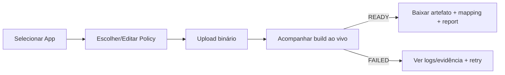

# 08 — Front-end

Stack: **React + Next.js (App Router) + TypeScript estrito**, TanStack Query (server state), Zustand (UI state), GraphQL (BFF) + REST. Design system próprio sobre **Radix UI** + **Tailwind**. Testes: Vitest + Testing Library + Playwright (E2E) + Storybook.

## Telas (mapa)

| Tela | Rota | Conteúdo |
|------|------|----------|
| Login/SSO | `/login` | OIDC, MFA (TOTP/WebAuthn) |
| Dashboard | `/` | KPIs: builds, cobertura, ataques em campo |
| Apps | `/apps` | CRUD apps, bundleId, chaves (ref) |
| Builds | `/apps/:id/builds` | Histórico, status ao vivo, download artefato/mapping, retry |
| Build detail | `/builds/:id` | Estados, evidências, report, logs |
| Policies | `/policies` | Editor visual + YAML, versões, assinatura |
| Relatórios | `/reports` | Before/after, cobertura, SBOM, protection diff |
| Observabilidade | `/field` | Mapa de tampering/rooting/hooking por região |
| Integrações | `/integrations` | Tokens CI/CD, webhooks, conectores |
| Admin | `/admin` | Usuários, RBAC, MFA/SSO, API keys, billing |

## Fluxo principal (proteger app)

## Componentes / Design System
- **Tokens**: cor (com *theming* por tenant), tipografia, espaçamento (escala 4px), sombras, raios.
- **Primitivos**: Button, Input, Select, Dialog, Toast, Table (virtualizada), Badge/StatusPill, CodeEditor (Monaco p/ YAML), Stepper (estados do build), Charts (Recharts/visx).
- **Padrões**: formulários com React Hook Form + Zod; *optimistic UI* em ações rápidas; *skeletons* em carregamento.

## Estados, mensagens, validações
- Estados por view: `loading | empty | error | success | partial`.
- Erros de API (RFC 9457) mapeados para *toasts*/inline; mensagens acionáveis (ex.: "Quota excedida — faça upgrade").
- Validação client-side (Zod) espelha regras do backend; nunca confiar só no client.

## Responsividade e Acessibilidade
- Breakpoints sm/md/lg/xl; layout *desktop-first* (uso profissional), utilizável em tablet.
- **WCAG 2.1 AA**: contraste ≥ 4.5:1, foco visível, navegação por teclado, ARIA em Dialog/Table/Stepper, *prefers-reduced-motion*, i18n (pt-BR/en).
- Meta de acessibilidade validada com axe-core no CI.

## Métrica de qualidade UX (do committee)
Pontuação atual **2.5/10** (só CLI existe). Meta V1: **≥ 7/10** com dashboard funcional, design system e a11y AA.
