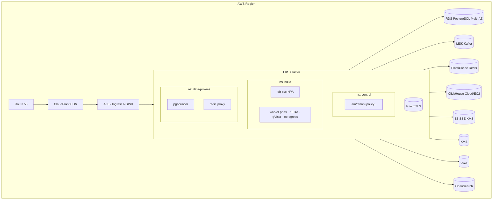

# 10 — Infraestrutura

> **Premissa:** AWS de referência (PR-02); tudo em **Terraform** (módulos) + **Helm** para apps; **ArgoCD** (GitOps).

## Visão

## Componentes

| Componente | Serviço AWS | Notas |
|-----------|-------------|-------|
| Orquestração | **EKS** | Namespaces control/build/data; nós dedicados a worker (taints) |
| Compute worker | Nodegroup **spot** + on-demand baseline | VM-heavy vs rename-light (bin-packing) |
| Sandbox | **gVisor (runsc)** RuntimeClass | Worker sem egress (NetworkPolicy deny-all) |
| Autoscaling | **KEDA** (lag Kafka) + HPA (CPU) + Cluster Autoscaler | |
| DB | **RDS PostgreSQL** Multi-AZ | PITR; read replicas em V2 |
| Fila | **MSK (Kafka)** + NATS (self-host) | Particionado por tenant |
| Cache | **ElastiCache Redis** | Locks/rate-limit |
| Telemetria | **ClickHouse** | Alto volume |
| Object store | **S3** (SSE-KMS, lifecycle/TTL, Object Lock p/ audit) | Pré-assinado |
| Segredos | **Vault** (+ AWS KMS unseal) | Dynamic secrets |
| Chaves assinatura | **KMS** (cloud) / **CloudHSM** ou PKCS#11 (on-prem) | Signer Broker |
| Logs/Search | **OpenSearch** | Retenção por tier |
| CDN | **CloudFront** | SDKs RASP + download de artefato |
| DNS | **Route 53** | |
| WAF | **AWS WAF** + Shield | OWASP managed rules |
| Rede | VPC privada, subnets isoladas, **sem IGW nos nós de worker**, VPC endpoints | Zero-trust |

## Segurança de infra
- **IAM**: roles por serviço (IRSA), *least privilege*, sem chaves estáticas.
- **Segmentação**: NetworkPolicies (deny-all default), mesh mTLS, worker sem egress.
- **Hardening**: imagens *distroless*, read-only FS, `no-new-privileges`, seccomp, non-root, Pod Security Standards *restricted*.
- **Secrets**: Vault + External Secrets Operator; nunca em env/ConfigMap.

## On-prem / Híbrido
- **On-prem:** Helm chart + imagens OCI assinadas (cosign) em registry privado; air-gapped bundle; KMS→HSM PKCS#11; IdP→Keycloak/LDAP/AD; licença offline por token assinado.
- **Híbrido (split-trust):** control plane SaaS; **self-hosted runner** dentro do cliente (mTLS+enrollment) executa build local; só status+hashes saem.

## Multi-region (V2)
- Ativo/passivo: control plane replicado (RDS cross-region read replica → promoção), object store replicado, Route 53 failover; build plane regional (dados do cliente não cruzam região sem consentimento — LGPD).
