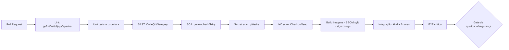

# 11 — DevOps / CI-CD

## Git flow / branching
- **Trunk-based** com branches curtas de feature; `main` sempre *deployável*.
- Nomenclatura: `feat/…`, `fix/…`, `docs/…`, `chore/…`. PR obrigatório, ≥1 review, checks verdes.
- **Conventional Commits**; versionamento **SemVer**; release por tag (`vX.Y.Z`).
- Proteção de `main`: required checks, no force-push, linear history.

## Pipeline CI (por PR)

**Gate de release (bloqueante):** testes verdes · cobertura ≥ meta · **corretude 100% nos golden apps** · fuzzing de parsers sem crash · sem *high/critical* em SAST/SCA · SBOM gerado e assinado · *red-team regression* sem regressões.

## CD (GitOps)
- **ArgoCD** sincroniza manifests de `main` (staging automático) e por *promotion* (produção).
- Ambientes: `dev` → `staging` → `prod`. Migrações via job com lock (expand-and-contract).

## Estratégias de deploy
| Estratégia | Uso |
|-----------|-----|
| **Rolling** | Serviços stateless padrão |
| **Blue/Green** | Gateway/BFF e mudanças de schema arriscadas |
| **Canary** (Argo Rollouts + métricas) | Engine/worker (analisa taxa de falha por pass, overhead) |
| **Feature flags** (OpenFeature/Flagsmith) | Ativar técnicas de proteção/rollout gradual |

- **Rollback:** automático por análise de métricas (Argo Rollouts) ou `argocd app rollback`; DB via `.down` testado; artefatos regeneráveis (determinismo).

## Supply chain (SLSA L3 alvo)
- Build hermético; proveniência assinada (in-toto/SLSA provenance); imagens *cosign*; SBOM (syft) por release; verificação de dependências (deps.dev/OSV); *pinned* actions por SHA.
- **Engine feeds** entregues como artefatos versionados/assinados (`.shieldpack`), importáveis em air-gapped.

## Ambientes efêmeros
- PR → ambiente preview (kind/EKS namespace) com dados sintéticos; destruído no merge.
