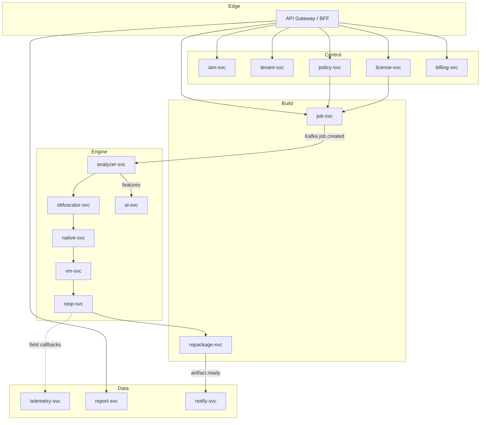
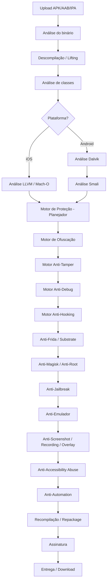
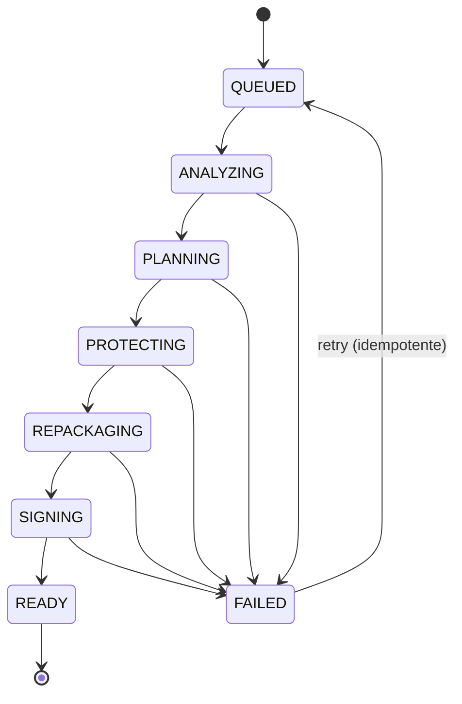

# SHIELD Platform — Documentação Técnica de Arquitetura

> **SHIELD** — *Secure Hardening & Integrity Enforcement Layer for Deployment*
> Plataforma enterprise de *Mobile Application Shielding* (RASP + Obfuscation + Anti-Tamper) para Android e iOS.
> Modelo de entrega: **SaaS multi-tenant**, **On-Premises** e **Híbrido**.
> Documento de arquitetura de referência — v1.0

---

## Sumário

1. [Arquitetura completa](#1-arquitetura-completa)
2. [Pipeline de processamento](#2-pipeline-de-processamento)
3. [Engine de ofuscação](#3-engine-de-ofuscação)
4. [Android](#4-android)
5. [iOS](#5-ios)
6. [Proteções em runtime (RASP)](#6-proteções-em-runtime-rasp)
7. [Anti-reverse engineering](#7-anti-reverse-engineering)
8. [Engine de virtualização (VM proprietária)](#8-engine-de-virtualização-vm-proprietária)
9. [IA aplicada à proteção](#9-ia-aplicada-à-proteção)
10. [Painel administrativo](#10-painel-administrativo)
11. [API (REST + GraphQL)](#11-api-rest--graphql)
12. [CLI](#12-cli)
13. [Integrações CI/CD](#13-integrações-cicd)
14. [Segurança da plataforma](#14-segurança-da-plataforma)
15. [Escalabilidade](#15-escalabilidade)
16. [Tecnologias recomendadas](#16-tecnologias-recomendadas)
17. [Roadmap](#17-roadmap)
18. [Diferenciais competitivos](#18-diferenciais-competitivos)
19. [Modelagem de dados](#19-modelagem-de-dados)
20. [Plano de testes](#20-plano-de-testes)
21. [Observabilidade](#21-observabilidade)
22. [Estimativa de esforço](#22-estimativa-de-esforço-por-módulo)
23. [Análise de riscos técnicos](#23-análise-de-riscos-técnicos)
24. [Comparativo com o mercado](#24-comparativo-com-o-mercado)

---

## Princípios arquiteturais norteadores

Antes das seções, os invariantes de projeto que guiam todas as decisões seguintes:

| # | Princípio | Consequência prática |
|---|-----------|----------------------|
| P1 | **Instrumentação sem código-fonte** | A plataforma opera sobre binários (APK/AAB/IPA), não sobre o *source*. Isso exige toolchain de *lifting/lowering* (Dalvik↔IR, Mach-O↔IR). |
| P2 | **Determinismo e reprodutibilidade** | Mesmo input + mesma *policy* + mesma versão de engine ⇒ output funcionalmente idêntico. Builds auditáveis. |
| P3 | **Camadas defensivas independentes** | Nenhuma proteção sozinha é suficiente. Defense-in-depth com *tripwires* redundantes e reação distribuída. |
| P4 | **Policy-as-Code** | Toda decisão de proteção é declarativa, versionada e assinada. Sem cliques manuais em produção. |
| P5 | **Zero-trust no worker** | O worker que manipula binários do cliente roda isolado (gVisor/Kata), sem rede de saída, com segredos efêmeros. |
| P6 | **Atualização contínua da defesa** | Assinaturas de detecção (Frida/Magisk/root) e técnicas de ofuscação são *feeds* atualizáveis sem rebuild da plataforma. |
| P7 | **Observabilidade da proteção** | Cada técnica aplicada é registrada, medível e correlacionável com telemetria de campo (RASP callbacks). |

---

## 1. Arquitetura completa

### 1.1 Arquitetura de alto nível

A plataforma se divide em cinco planos lógicos:

- **Control Plane** — identidade, tenants, políticas, licenças, billing, RBAC.
- **Build Plane** — orquestração de jobs, workers de proteção, artefatos.
- **Protection Engine Plane** — os motores propriamente ditos (ofuscação, anti-tamper, VM, RASP injector).
- **Data Plane** — metadados, telemetria de campo (RASP), auditoria, object storage.
- **Edge Plane** — API gateway, CLI endpoints, webhooks CI/CD, CDN de SDKs.

```
                        ┌─────────────────────────────────────────────────────┐
                        │                     EDGE PLANE                       │
                        │  API Gateway · CLI Endpoint · Webhooks · CDN(SDK)    │
                        └───────────────┬─────────────────────┬───────────────┘
                                        │                     │
        ┌───────────────────────────────▼──────┐   ┌──────────▼──────────────────────┐
        │            CONTROL PLANE              │   │           BUILD PLANE            │
        │  IAM/SSO · Tenant · Policy Registry   │   │  Job Orchestrator · Scheduler    │
        │  License · Billing · RBAC · Audit     │   │  Artifact Store · Signer Broker  │
        └───────────────┬───────────────────────┘   └──────────┬──────────────────────┘
                        │                                       │
                        │                            ┌──────────▼───────────────────────┐
                        │                            │     PROTECTION ENGINE PLANE       │
                        │                            │  Analyzer · Obfuscator · VM       │
                        │                            │  AntiTamper · RASP Injector       │
                        │                            │  Native Protector · Repackager    │
                        │                            └──────────┬───────────────────────┘
                        │                                       │
        ┌───────────────▼───────────────────────────────────────▼──────────────────────┐
        │                                DATA PLANE                                      │
        │  PostgreSQL(metadata) · Object Store(artifacts) · ClickHouse(RASP telemetry)  │
        │  Redis(cache/locks) · Elasticsearch(logs) · Vault(secrets) · KMS/HSM(keys)    │
        └───────────────────────────────────────────────────────────────────────────────┘
```

### 1.2 Arquitetura de microsserviços

Divisão por *bounded context* (DDD). Cada serviço tem seu banco (database-per-service) e comunica-se por eventos (Kafka) + RPC síncrono (gRPC) apenas onde a latência exige.

| Serviço | Responsabilidade | Stack sugerida | Comunicação |
|---------|------------------|----------------|-------------|
| `iam-svc` | Auth, SSO/OIDC, MFA, sessões | Go + PostgreSQL | gRPC/REST |
| `tenant-svc` | Empresas, usuários, RBAC | Go + PostgreSQL | gRPC + eventos |
| `policy-svc` | Registro/validação de policies, versionamento, assinatura | Rust + PostgreSQL | gRPC |
| `license-svc` | Licenças, quotas, entitlements | Go + PostgreSQL | eventos |
| `billing-svc` | Uso, faturamento, integração Stripe | Go + PostgreSQL | eventos |
| `job-svc` | Ciclo de vida de builds, estados, retries | Go + PostgreSQL + Redis | gRPC + Kafka |
| `analyzer-svc` | Descompilação, análise estática, feature extraction | Rust/C++ | consome fila |
| `obfuscator-svc` | Ofuscação Dalvik/IR | Rust | consome fila |
| `native-svc` | Proteção C/C++/Rust/Swift/ObjC (LLVM pass) | C++/Rust (LLVM) | consome fila |
| `vm-svc` | Virtualização de código (bytecode proprietário) | Rust | consome fila |
| `rasp-svc` | Injeção de SDK RASP + configuração | Rust + Go | consome fila |
| `repackage-svc` | Recompilação, alinhamento, assinatura | Go + toolchains | consome fila |
| `ai-svc` | Detecção de código sensível, sugestão de policies | Python (Triton/ONNX) | gRPC |
| `telemetry-svc` | Ingestão de callbacks RASP de campo | Go + ClickHouse | HTTP ingest |
| `report-svc` | Relatórios de segurança, SBOM, evidências | Go + PostgreSQL | eventos |
| `notify-svc` | Webhooks, e-mail, Slack, CI/CD callbacks | Go | eventos |
| `gateway` | BFF, rate-limit, authz edge | Go (Envoy sidecar) | REST/GraphQL |



### 1.3 Arquitetura cloud-native

- **Kubernetes** como substrato (EKS/GKE/AKS ou on-prem).
- **Workers efêmeros**: cada build roda em Pod descartável, *sandbox* gVisor/Kata, sem egress, FS *read-only* exceto scratch.
- **KEDA** para autoscaling orientado a fila (profundidade de tópico Kafka/RabbitMQ ⇒ réplicas de worker).
- **Object storage** (S3/MinIO) para artefatos; **lifecycle** com criptografia SSE-KMS e retenção por tenant.
- **Service mesh** (Istio/Linkerd) para mTLS interno, retries, circuit breaking e *policy* de rede zero-trust.
- **GitOps** (ArgoCD) para deploy declarativo; *engine feeds* (assinaturas) entregues como artefatos versionados.

```
┌──────────────────────── Kubernetes Cluster ─────────────────────────┐
│  Namespace: control       Namespace: build         Namespace: data  │
│  ┌────────────┐           ┌──────────────────┐     ┌─────────────┐   │
│  │ iam/tenant │           │ job-svc (HPA)    │     │ postgres HA │   │
│  │ policy/... │           │ ┌──────────────┐ │     │ clickhouse  │   │
│  └────────────┘           │ │ worker pods  │ │     │ redis/kafka │   │
│                           │ │ (KEDA scaled)│ │     │ vault/minio │   │
│  Istio mTLS everywhere    │ │ gVisor sbox  │ │     └─────────────┘   │
│                           │ └──────────────┘ │                       │
│                           └──────────────────┘                       │
└──────────────────────────────────────────────────────────────────────┘
```

### 1.4 Arquitetura on-premises

Para clientes regulados (bancos, defesa, governo) que não podem enviar binários para fora do perímetro:

- Distribuição como **Helm chart + imagens OCI assinadas** (cosign) em registry privado.
- **Air-gapped**: bundle offline com todas as dependências, engine feeds importáveis por arquivo assinado.
- Dependências externas substituíveis: KMS→HSM local (PKCS#11), object store→MinIO, IdP→Keycloak/LDAP/AD.
- Licenciamento offline por **token assinado** (chave pública embarcada), com *heartbeat* opcional.
- **Nenhuma telemetria sai** sem opt-in; relatórios gerados localmente.

```
┌───────────────── Cliente (Data Center / Air-Gapped) ─────────────────┐
│  SHIELD Helm Release                                                 │
│   Control+Build+Engine (mesmos serviços)                             │
│   Keycloak/AD ── PKCS#11 HSM ── MinIO ── Postgres ── Kafka           │
│   License token (offline, signed)                                    │
│   Engine Feed importado via .shieldpack assinado                     │
└──────────────────────────────────────────────────────────────────────┘
        ▲ (opcional, mTLS) update feed assinado (sem dados do cliente)
        │
   SHIELD Update CDN
```

### 1.5 Arquitetura híbrida

O *Control Plane* (identidade, políticas, billing, dashboards) roda em SaaS; o *Build/Engine Plane* (que toca o binário do cliente) roda **dentro do perímetro do cliente** como *runner* auto-hospedado — análogo a GitHub Actions self-hosted runners.

- **Split-trust**: metadados e políticas na nuvem; artefatos e chaves de assinatura nunca saem do cliente.
- **Runner registra-se** no control plane via mTLS + token de *enrollment*; recebe jobs, executa localmente, devolve apenas *status* e *evidence hashes*.
- Ideal para quem quer UX de SaaS com *compliance* de on-prem.

```
   SaaS Control Plane                     Cliente
  ┌──────────────────┐   job (metadata)  ┌──────────────────────┐
  │ policy/license   │──────────────────▶│ Self-hosted Runner   │
  │ dashboard/billing│◀──────────────────│  Engine + Signer(HSM)│
  └──────────────────┘  status+hashes    │  artifact stays local│
                                          └──────────────────────┘
```

**Justificativa arquitetural (resumo):** database-per-service evita acoplamento e permite escalar o `analyzer/obfuscator` (CPU-bound, custosos) independentemente do control plane (I/O-bound). Comunicação por eventos desacopla o pipeline longo (um build pode levar minutos) da API síncrona. O isolamento do worker (P5) é inegociável: manipular binários potencialmente maliciosos de terceiros exige *sandbox* de kernel.

---

## 2. Pipeline de processamento

### 2.1 Visão geral do fluxo



### 2.2 Detalhamento por estágio

**1) Upload (APK/AAB/IPA)** — Multipart resumable (tus) → object store criptografado. Validação de formato, tamanho, *malware pre-scan* (ClamAV/YARA) e verificação de que o tenant tem entitlement. Gera `build_id` e evento `job.created`.

**2) Análise do binário** — Identificação de container: ZIP (APK/AAB/IPA), leitura de `AndroidManifest.xml`/`Info.plist`, mapeamento de DEX, libs nativas (`lib/*/*.so`), frameworks (`Frameworks/*.dylib`), arquitetura (arm64-v8a, x86_64), min/target SDK, presença de ofuscação prévia. Produz o **Binary Manifest** (inventário estruturado).

**3) Descompilação / Lifting** — Converte o binário em uma **IR interna unificada (SHIELD-IR)**:
- Android: DEX → *lifting* para SHIELD-IR (baseado em análise de bytecode Dalvik; usa toolchain própria inspirada em Soot/dexlib2/SMALI).
- iOS: Mach-O → desmontagem (Capstone) + *lifting* opcional para IR onde há *bitcode*/símbolos; caso contrário, instrumentação em nível de seção Mach-O.
- SHIELD-IR abstrai ambas as plataformas para que os *passes* de proteção sejam majoritariamente compartilhados.

**4) Análise de classes** — Constrói *call graph*, *class hierarchy*, *data-flow* (def-use), pontos de entrada (Activities, Services, `main`, `@objc` selectors), e marca *reachability*. Necessário para renomeação segura e para não quebrar *reflection*/serialização.

**5) Análise LLVM (iOS)** — Quando há *bitcode* ou libs compiladas via toolchain do cliente, aplica-se um conjunto de **LLVM passes** proprietários (CFG flattening, MBA, opaque predicates) no nível IR antes do *lowering*.

**6) Análise Dalvik / 7) Smali** — Normalização do bytecode em representação Smali-like editável; resolução de *try/catch*, *switch payloads*, registradores. É onde ocorrem as transformações Dalvik-específicas.

**8) Motor de proteção (Planner)** — **Núcleo de decisão.** Recebe: (a) SHIELD-IR + análises, (b) *policy* do tenant, (c) sugestões do `ai-svc` (código sensível). Produz um **Protection Plan** — DAG ordenado de transformações com orçamento de custo (impacto em tamanho/latência) e restrições de compatibilidade. Os motores seguintes são *passes* executados segundo esse plano.

**9–20) Motores de proteção** — Ofuscação → Anti-Tamper → Anti-Debug → Anti-Hooking → Anti-Frida → Anti-Magisk → Anti-Root → Anti-Jailbreak → Anti-Emulador → Anti-Screenshot/Recording/Overlay → Anti-Accessibility → Anti-Automation. Cada motor é idempotente sobre a IR e emite *evidence* (o que aplicou, onde). Detalhados nas seções 3, 6 e 7.

**21) Recompilação / Repackage** — SHIELD-IR → DEX/Mach-O; realinhamento (`zipalign`), reempacotamento, atualização de `Info.plist`/manifest, injeção de libs RASP nativas, *resource* rewrite.

**22) Assinatura** — Android: v2/v3/v4 (APK Signing Block) via chave no HSM/KMS (o *Signer Broker* nunca expõe a chave). iOS: reassinatura com *provisioning profile* + *entitlements* (ou entrega *unsigned* para o cliente assinar no Xcode/fastlane em fluxos que exigem certificado Apple do próprio cliente).

**23) Entrega** — Artefato protegido para download (URL pré-assinada, TTL curto), *mapping file* (para *de-obfuscation* de stack traces), relatório de segurança e SBOM. Evento `artifact.ready` → webhook CI/CD.

### 2.3 Máquina de estados do job



Cada transição é persistida (event-sourcing no `job-svc`) com *idempotency key*, permitindo *retry* seguro e reconstrução do histórico para auditoria.

---

## 3. Engine de ofuscação

Objetivo: paridade ou superioridade frente a ProGuard/R8/DexGuard, operando sobre SHIELD-IR (multiplataforma). Cada transformação é um *pass* com nível de intensidade (0–5) definido por policy e por *risk score* (IA).

### 3.1 Renomeação (Identifier Renaming)

Renomeia **classes, interfaces, métodos, campos, variáveis locais e pacotes** para identificadores curtos e/ou *homoglyphs*/*unicode confusables* (opcional), preservando semântica.

- **Estratégia de dicionário**: `a, b, c…`, ou nomes ilegíveis reutilizados em escopos diferentes (*overloading-induced ambiguity*): o mesmo nome `a` significando coisas distintas por contexto confunde ferramentas.
- **Reachability-aware**: pontos de entrada do Android (Activities no manifest), *serializable fields*, *enums*, `@Keep`, JNI (`Java_...`), *reflection targets* detectados por *data-flow* → adicionados automaticamente a *keep rules* para não quebrar runtime.
- **Mapping assinado**: `mapping.txt` cifrado com a chave do tenant, necessário para *retrace* de stack traces em produção.

```
com.bank.payment.CardValidator.validate(String) → a.b.c.a(String)
com.bank.payment.CardValidator.cvvField        → a.b.c.d
package com.bank.payment                        → a.b.c
```

### 3.2 Ofuscação de controle de fluxo (Control Flow)

- **Control Flow Flattening**: transforma a estrutura de blocos básicos em um *dispatcher* central (switch sobre uma variável de estado), destruindo a topologia natural do CFG. Decompiladores produzem código plano e ilegível.

```
// Antes                          // Depois (flattened)
if (x) { A(); } else { B(); }     int s = 0;
C();                              while (true) {
                                    switch (s) {
                                      case 0: s = x ? 1 : 2; break;
                                      case 1: A(); s = 3; break;
                                      case 2: B(); s = 3; break;
                                      case 3: C(); s = -1; break;
                                      default: return;
                                    }
                                    if (s < 0) break;
                                  }
```

- **Opaque Predicates**: inserção de condicionais cujo valor é conhecido em tempo de proteção mas indecidível estaticamente (ex.: `(x*x - x) % 2 == 0` sempre verdadeiro para inteiros). Direcionam *fake branches*.
- **Dead Code Insertion**: código sintaticamente válido e nunca executado, entrelaçado com o real.
- **Fake Branches / Fake Exceptions**: caminhos que lançam exceções tratadas silenciosamente, poluindo o *exception table* e confundindo o *dominator analysis*.
- **Loop Transformations**: *loop unrolling* parcial, *loop inversion*, *splitting* — quebram *pattern matching* de decompiladores.

### 3.3 Criptografia de strings

- **Algoritmos**: AES-128/256-GCM para strings sensíveis; XOR rotativo para strings de baixo risco (custo menor); **chaves dinâmicas** derivadas em runtime (nunca constantes no binário).
- **Runtime Decryption**: cada string vira uma chamada `decrypt(id)` resolvida sob demanda; a chave é reconstruída de fragmentos espalhados + *device entropy* opcional.
- **Constant Encryption**: `int`, `long`, `float`, `double`, `boolean`, `char`, e **arrays** são cifrados/decompostos (ex.: `42` vira `(getA() ^ getB()) - getC()` com MBA — *Mixed Boolean-Arithmetic*).

```
// Antes
String key = "sk_live_9f2a...";

// Depois
String key = SH.d(0x2f, ctxSalt());   // AES-GCM, chave derivada em runtime
```

### 3.4 Reflection & Dynamic Invocation

- **Reflection Obfuscation**: chamadas diretas viram `Class.forName(dec("...")).getMethod(dec("..."))...invoke(...)` — o *call graph* estático deixa de revelar quem chama quem.
- **Dynamic Invocation**: substituição de chamadas estáticas por *invoke-dynamic*/*MethodHandles* (Android) ou `objc_msgSend` dinâmico (iOS), quebrando *xrefs* estáticos.
- Usado com parcimônia (reflection tem custo de performance): o Planner limita a APIs marcadas como sensíveis pela IA.

### 3.5 Metadata Removal

Remove **nomes de parâmetros, comentários, *debug info* (LineNumberTable, LocalVariableTable), símbolos, anotações não essenciais, *source file* attribute**. Em Mach-O: *strip* de símbolos, remoção de `__LINKEDIT` supérfluo, apagamento de *Swift metadata* não requerido.

### 3.6 Resource Obfuscation

- **XML/Layouts**: renomeação de IDs de recursos, *shrinking* de recursos não usados, *inlining* de valores.
- **Assets**: cifragem opcional de assets sensíveis (decifrados via *AssetManager* proxy).
- **`resources.arsc`**: renomeação/embaralhamento da tabela de recursos, remoção de nomes legíveis mantendo os IDs numéricos.

### 3.7 Native Code Protection (C / C++ / Rust / JNI / Swift / Objective-C)

Aplicada via **LLVM passes proprietários** (para código com IR/bitcode disponível) e via **binary rewriting** (para `.so`/`.dylib` já compilados):

| Técnica | Nível LLVM IR | Nível binário (.so/.dylib) |
|---------|---------------|-----------------------------|
| Instruction substitution (MBA) | ✅ | parcial |
| CFG flattening | ✅ | ✅ (via lifting) |
| Bogus control flow | ✅ | ✅ |
| String/const encryption | ✅ | ✅ |
| Symbol stripping | ✅ | ✅ |
| **Code virtualization** (VM) | ✅ (hot funcs) | ✅ (funcs selecionadas) |
| Anti-disassembly (opaque jumps) | ✅ | ✅ |
| JNI binding obfuscation | ✅ | ✅ |

- **JNI**: nomes `Java_pkg_Class_method` são ofuscados via `RegisterNatives` dinâmico, escondendo o mapeamento Java↔nativo.
- **Swift/ObjC**: ofuscação de *selectors*, *metadata* e *witness tables*; *symbol renaming* respeitando ABI.
- **Rust**: opera sobre a IR LLVM emitida pelo `rustc` (via plugin de compilação para clientes com source, ou binário para `.so` prontos).

---

## 4. Android

| Alvo | Estratégia de proteção |
|------|------------------------|
| **APK** | Pipeline completo: DEX obfuscation, RASP inject, native protect, re-sign v2/v3/v4. |
| **AAB** | Proteção por *base module* + *dynamic feature modules*; regeneração de *split APKs*; compatível com Play App Signing (entrega do artefato para o Play re-assinar). |
| **DEX** | Lifting → SHIELD-IR → transforms → *rebuild*; suporte a multidex; controle de tamanho para não estourar limite de métodos (64K por DEX). |
| **OAT/ART** | A proteção mira o DEX (fonte do OAT); opcionalmente força *interpret-only* em métodos virtualizados para impedir *dumping* do código JIT-compilado; detecção de *ART hooking* (ex.: `Epic`, `YAHFA`). |
| **Smali** | Camada de edição intermediária; *anti-smali* patterns (registradores confusos, *goto* excessivos). |
| **JNI/NDK** | Proteção nativa (seção 3.7), `RegisterNatives` dinâmico, verificação de integridade das `.so` em runtime, detecção de `.so` injetadas. |

**Anti-repackaging Android**: verificação da assinatura (v2 signing block digest) em runtime vs. valor esperado embutido cifrado; se o app foi re-assinado por um atacante, a checagem falha e dispara reação configurável (crash, degradação silenciosa, *server report*).

---

## 5. iOS

| Alvo | Estratégia de proteção |
|------|------------------------|
| **IPA** | Reempacotamento com `.dylib` RASP embarcada, *entitlements* preservados, re-assinatura opcional. |
| **Mach-O** | *Load command* rewriting, *symbol stripping*, cifragem de seções (`__TEXT`/`__cstring`), anti-`otool`/anti-`class-dump`. |
| **LLVM/Bitcode** | Passes proprietários no IR quando bitcode disponível (obsoleto na Apple moderna, mas suportado para pipelines legados/enterprise). |
| **Swift** | Ofuscação de *metadata*, *mangled names*, *protocol witness tables*; string encryption; anti-*swift-demangle*. |
| **Objective-C** | Ofuscação de *selectors* e `objc` runtime metadata; `objc_msgSend` dinâmico; anti-`class-dump`. |
| **Metal** | Proteção de *shaders* (`.metallib`): cifragem e carregamento em runtime para IP gráfico sensível. |

**Jailbreak-aware**: as `.dylib` RASP detectam ambientes comprometidos (ver seção 6) e *fishhook*/*Substrate* *rebindings*.

---

## 6. Proteções em runtime (RASP)

Entregues como **SDK nativo** (`.so`/`.dylib`) injetado automaticamente, com API opcional para o app. Filosofia (P3): múltiplos *tripwires* redundantes, checagens ofuscadas e virtualizadas, reação **desacoplada** do ponto de detecção (a detecção marca um flag cifrado; a reação ocorre depois, em outro lugar, dificultando o *bypass* por *patch* local).

| Módulo | Sinais de detecção (exemplos) |
|--------|-------------------------------|
| **Root Detection** | `su` binaries, `magisk` paths, `ro.debuggable`, mounts `rw` em `/system`, pacotes conhecidos. |
| **Jailbreak Detection** | `/Applications/Cydia.app`, `/bin/bash`, `fork()` permitido, esquema `cydia://`, sandbox escape checks. |
| **Frida Detection** | portas 27042/27043, thread `gum-js-loop`, strings `frida`/`gadget` em `/proc/self/maps`, D-Bus, *named pipes*, checagem de `ptrace`. |
| **Magisk Detection** | `magiskd`, *Zygisk* artifacts, `/data/adb/modules`, *denylist* awareness, *mount namespace* anomalies. |
| **LSPosed/Xposed/Substrate/Hook** | classes `de.robv.android.xposed`, `XposedBridge`, `.jar` injetados, PLT/GOT hooks, inline hook *trampolines*, `objc` swizzling anômalo. |
| **Debugger/Tracer Detection** | `TracerPid` em `/proc/self/status`, `ptrace(PTRACE_TRACEME)` self-attach, `isatty`, timing checks, `sysctl(P_TRACED)` (iOS). |
| **Emulator Detection** | props QEMU/Genymotion, sensores ausentes, `qemu_pipe`, MAC/IMEI padrão, GPU renderer, *build fingerprint*. |
| **Virtual Space / App Cloning** | múltiplos *data dirs*, `/proc/self/maps` com paths de VirtualApp/Parallel Space, UID anômalo. |
| **Overlay Detection** | `TYPE_APPLICATION_OVERLAY` sobre telas sensíveis, `obscuredTouch`, *tapjacking* flags. |
| **Accessibility Abuse** | serviços de acessibilidade não confiáveis ativos durante fluxos sensíveis; *node injection*. |
| **Dynamic Instrumentation** | integridade de código em memória (hash de *text segments*), detecção de *JIT hooks*, *maps* R+W+X anômalos. |
| **Tamper Detection** | assinatura/hash do pacote, integridade de `.so`, *installer package* esperado, *repackaging* checks. |
| **Memory Dump Detection** | `mprotect` anômalo, leitura de `/proc/self/mem` por terceiros, *core dump* flags. |
| **Screen Capture/Recording/Screenshot** | `FLAG_SECURE` (Android), `isCaptured`/`UIScreen.capturedDidChange` (iOS), detecção de *screen recording*. |
| **Certificate/SSL Pinning + TLS Hardening** | *pinning* por chave pública (SPKI), *anti-proxy*, rejeição de CAs de usuário, TLS 1.3 mínimo, *anti-mitmproxy*. |
| **Biometric Integrity** | verificação de *class 3 biometrics*, *keystore-bound* auth, anti-replay. |
| **Secure Storage / Keystore / Keychain** | dados cifrados via Android Keystore (StrongBox) / iOS Keychain (Secure Enclave), *hardware-backed keys*. |
| **Runtime Integrity / Signature / Environment Validation** | verificação contínua da cadeia (assinatura, ambiente, *anti-hook self-check*). |

### 6.1 Modelo de reação (Response Policy)

```
detecção → set flag cifrado (distribuído) → verificação diferida em N pontos →
   ação ∈ { report-only, degrade (bloquear feature), fake-data, crash, wipe-session }
```

Configurável por *risk tier* e por app. A separação temporal/espacial entre detecção e reação é o que dificulta o *bypass* — não existe um único `if (isRooted) exit()` para patchear.

---

## 7. Anti-reverse engineering

| Técnica | Descrição |
|---------|-----------|
| **Control Flow Obfuscation** | flattening + opaque predicates (seção 3.2). |
| **Instruction Mutation** | substituição de instruções por equivalências semânticas (MBA, peephole reverso). |
| **Instruction Reordering** | reordenação respeitando dependências de dados, quebrando *pattern matching*. |
| **VM Obfuscation / Code Virtualization** | trechos críticos compilados para **bytecode proprietário** interpretado por VM embarcada (seção 8). |
| **Custom Bytecode** | ISA própria, diferente a cada build (*polymorphic opcodes*). |
| **Self-Modifying Code** | seções que se decifram/reescrevem em runtime antes de executar. |
| **Runtime Code Generation** | *stubs* gerados dinamicamente, impedindo análise estática total. |
| **Encrypted Methods/Classes** | corpo de método/classe cifrado, decifrado *just-in-time* na primeira invocação. |
| **Dynamic Loading / Split Code** | lógica crítica em *payloads* carregados e decifrados sob demanda. |
| **Dummy Classes/Methods, Fake Packages** | ruído estrutural em massa. |
| **Anti-Decompiler** | payloads malformados propositais que quebram jadx/JEB/Ghidra sem afetar execução. |
| **Anti-Disassembler** | *opaque jumps*, dados no *code segment*, *overlapping instructions* (x86)/*thumb-mode confusion* (ARM). |
| **Anti-Static Analysis** | reflection + dynamic invocation + string enc destroem *xrefs*. |
| **Anti-Dynamic Analysis** | anti-debug + anti-Frida + timing + integridade em memória. |

---

## 8. Engine de virtualização (VM proprietária)

Para os trechos de maior valor (validação de licença, crypto, lógica financeira), o código é **traduzido para uma máquina virtual customizada** — a técnica mais cara de reverter, usada por Denuvo/VMProtect/Themida no mundo desktop e por fornecedores premium no mobile.

### 8.1 Arquitetura da VM

```
   Função crítica (SHIELD-IR)
            │  (VM Compiler)
            ▼
   Bytecode proprietário (.vmx blob, cifrado)
            │
   ┌────────▼──────────────────────────────────┐
   │  VM Interpreter (embarcada no .so/.dylib)  │
   │  ┌──────────┐  ┌───────────┐  ┌─────────┐  │
   │  │ Fetch    │→ │ Decode    │→ │ Dispatch│  │
   │  │(decrypt) │  │(handler#) │  │(exec op)│  │
   │  └──────────┘  └───────────┘  └─────────┘  │
   │   VM registers · VM stack · handler table  │
   └────────────────────────────────────────────┘
```

- **Opcode próprio**: conjunto de instruções abstratas (push, load, alu, call, branch, syscall-proxy) mapeadas para *handlers*. O mapeamento **opcode→handler é embaralhado por build** (*polymorphism*), então um *dump* de uma VM não ajuda a reverter outra.
- **Bytecode proprietário**: formato `.vmx` cifrado, decifrado em blocos durante o *fetch*, nunca inteiro em memória.
- **Interpretador**: *threaded dispatch* (computed goto) para performance; *handlers* individualmente ofuscados e alguns aninhados (VM-dentro-de-VM para os trechos mais sensíveis).
- **Compilador**: traduz SHIELD-IR → bytecode VM, aplicando *register allocation* própria e inserção de *anti-tamper* dentro do bytecode.

### 8.2 Trade-off

Virtualização impõe *overhead* de 10×–100× — por isso é aplicada **cirurgicamente** (só *hot spots* de segurança escolhidos por policy/IA), não ao app inteiro.


---

## 9. IA aplicada à proteção

O `ai-svc` transforma a plataforma de "aplicar tudo cegamente" para **proteção adaptativa baseada em risco** — este é um diferencial central (seção 18).

### 9.1 Detecção automática de código sensível

Pipeline de features extraídas pelo `analyzer-svc` alimentando modelos:

| Detecção | Técnica | Sinal |
|----------|---------|-------|
| **Algoritmos criptográficos** | *pattern matching* + classificador sobre CFG/opcodes | S-boxes AES, constantes SHA, curvas EC, laços de *rounds*. |
| **APIs críticas** | grafo de chamadas + *embeddings* de método | Keystore, biometric, network, `Cipher`, `SecKey`. |
| **Credenciais/segredos** | NER + regex + entropia (Shannon) | `sk_live_`, JWTs, chaves privadas, tokens embutidos. |
| **Fluxo financeiro** | *taint analysis* + classificação de texto | métodos com "payment", "balance", "pix", "card", "transfer". |
| **Padrões reversíveis** | modelo que estima "reversibilidade" de um método | métodos curtos, sem ofuscação, alto valor. |

### 9.2 Do sinal à ação

O `ai-svc` produz um **Risk Map**: para cada símbolo, um `risk_score ∈ [0,1]` e recomendações (`{virtualize, string-encrypt, rasp-guard}`). O Planner (seção 2.2, estágio 8) consome esse mapa e monta o Protection Plan respeitando o *budget* (tamanho/latência). Assim, a virtualização cara vai só para o *top-k* de maior risco.

### 9.3 Arquitetura de modelos

- **Extração**: features estáticas (opcodes n-grams, CFG graph embeddings via GNN, strings, chamadas de API).
- **Modelos**: GNN para *code embeddings* + gradient boosting para classificação; LLM pequeno *fine-tuned* para *secret/PII detection* em strings/símbolos.
- **Serving**: ONNX Runtime/Triton, gRPC, *batch* por build. Modelos versionados e assinados (não podem ser trocados sem trilha de auditoria).
- **Feedback loop**: telemetria de campo (quais proteções foram efetivamente atacadas) re-treina o *risk model* — a defesa aprende com os ataques reais.

> **Nota de responsabilidade:** nenhum segredo detectado é armazenado em claro; apenas *hashes*/localizações. O objetivo é proteger, não coletar.

---

## 10. Painel administrativo

SPA (React) consumindo o BFF/GraphQL. Multi-tenant, com *theming* por empresa.

| Área | Conteúdo |
|------|----------|
| **Usuários** | CRUD, papéis, status, último acesso, MFA enrollment. |
| **Empresas (Tenants)** | organizações, subdomínios, limites, plano. |
| **Aplicativos** | apps cadastrados, plataformas, *bundle IDs*, chaves de assinatura vinculadas. |
| **Proteções** | catálogo de técnicas, presets, *policy editor* (visual + YAML). |
| **Relatórios** | *security report* por build, *before/after*, cobertura de proteção, SBOM. |
| **Logs** | logs de build, *audit trail*, exportação. |
| **Licenças** | entitlements, quotas, consumo, renovação. |
| **Integrações** | tokens CI/CD, webhooks, conectores. |
| **Builds** | histórico, status ao vivo, download de artefato/mapping, *retry*. |
| **Auditoria** | quem fez o quê, quando (imutável, *append-only*). |
| **RBAC** | matriz papel×permissão, papéis customizados. |
| **MFA / SSO** | TOTP/WebAuthn, SAML/OIDC (Okta, Azure AD, Google). |
| **API Keys** | criação/rotação/escopo de chaves, *service accounts*. |
| **Billing** | uso, faturas, método de pagamento, *usage-based pricing*. |

**Observabilidade de proteção no dashboard**: gráficos de campo (RASP) — quantos devices *rooted/hooked* tentaram rodar o app, distribuição geográfica de ataques, técnica mais acionada — fechando o ciclo P7.

---

## 11. API (REST + GraphQL)

REST para operações de recurso/CI-CD (previsível, cacheável); GraphQL para o dashboard (queries compostas, evita *over-fetching*). Ambas atrás do BFF, com OAuth2/JWT e *rate-limit* por tenant.

### 11.1 Endpoints REST (exemplos)

```
POST   /v1/apps/{appId}/builds            # inicia build (upload multipart resumable)
GET    /v1/builds/{buildId}               # status + estados
GET    /v1/builds/{buildId}/artifact      # URL pré-assinada do protegido
GET    /v1/builds/{buildId}/mapping       # mapping cifrado (retrace)
GET    /v1/builds/{buildId}/report        # security report (JSON/PDF) + SBOM
GET    /v1/builds/{buildId}/logs          # logs (paginado)
POST   /v1/builds/{buildId}/sign          # dispara assinatura (HSM broker)
POST   /v1/policies                       # cria/atualiza policy (policy-as-code)
GET    /v1/licenses                       # entitlements/quotas
POST   /v1/users  ·  GET /v1/users        # gestão de usuários
GET    /v1/protections                    # catálogo de técnicas
```

Exemplo de criação de build:

```http
POST /v1/apps/app_123/builds
Authorization: Bearer <jwt>
Idempotency-Key: 5f3c...

{ "policyId": "pol_prod_high", "artifactUploadId": "up_abc", "platform": "android" }

202 Accepted
{ "buildId": "bld_789", "status": "QUEUED", "statusUrl": "/v1/builds/bld_789" }
```

### 11.2 GraphQL (esquema resumido)

```graphql
type Query {
  app(id: ID!): App
  build(id: ID!): Build
  builds(appId: ID!, first: Int, after: String): BuildConnection!
  policies: [Policy!]!
  fieldTelemetry(appId: ID!, range: TimeRange!): TelemetrySummary!
}

type Mutation {
  createBuild(input: CreateBuildInput!): Build!
  upsertPolicy(input: PolicyInput!): Policy!
  rotateApiKey(id: ID!): ApiKey!
}

type Build {
  id: ID!
  status: BuildStatus!
  app: App!
  policy: Policy!
  appliedProtections: [AppliedProtection!]!
  report: SecurityReport
  createdAt: DateTime!
}
enum BuildStatus { QUEUED ANALYZING PLANNING PROTECTING REPACKAGING SIGNING READY FAILED }
```

---

## 12. CLI

Binário único (Go, cross-compilado), autenticação por API key/OIDC device flow, ideal para pipelines.

```bash
shield login                                  # OIDC device flow / api-key
shield protect app.apk --policy prod-high     # atalho: build + espera + download
shield analyze app.apk                        # relatório de análise sem proteger
shield build --app app_123 --policy pol_prod  # inicia build
shield status bld_789 --watch                 # acompanha em tempo real
shield download bld_789 -o app-protected.apk  # baixa artefato
shield sign bld_789 --key hsm://prod          # assina via broker HSM
shield upload app.aab --app app_123           # upload avulso
shield report bld_789 --format pdf            # gera relatório de segurança
shield policy validate policy.yaml            # valida policy-as-code
```

Saída *machine-readable* (`--json`) para integração; *exit codes* padronizados (0 ok, ≥10 falha de proteção, ≥20 falha de policy).

---

## 13. Integrações CI/CD

Modelo de integração: **plugin/action nativo** + **CLI** + **webhooks**. Cada um dispara `shield build` e faz *gate* no resultado (falha o pipeline se a proteção falhar ou se o *security report* violar *thresholds*).

| Plataforma | Mecanismo |
|------------|-----------|
| **GitHub Actions** | `shield-org/protect-action@v1` (composite action). |
| **GitLab CI** | template `.gitlab-ci.yml` incluível + imagem do CLI. |
| **Azure DevOps** | *Extension* na Marketplace + task YAML. |
| **Bitbucket Pipelines** | *pipe* `shield/protect`. |
| **Jenkins** | plugin + *shared library* (`shieldProtect{}`). |
| **CircleCI** | *orb* `shield/mobile`. |
| **TeamCity** | *meta-runner* + CLI. |
| **ArgoCD** | *hook* pós-build (para pipelines GitOps de distribuição interna). |
| **Kubernetes** | os *self-hosted runners* (híbrido) rodam como Jobs. |
| **Docker** | imagem oficial `shield/cli` e `shield/runner`. |
| **Terraform** | *provider* `shield` para gerir apps, policies, keys como IaC. |

Exemplo GitHub Actions:

```yaml
- uses: shield-org/protect-action@v1
  with:
    api-key: ${{ secrets.SHIELD_API_KEY }}
    artifact: app/build/outputs/bundle/release/app-release.aab
    policy: prod-high
    fail-on: report-threshold   # falha o build se cobertura < X
```

---

## 14. Segurança da plataforma

| Camada | Controles |
|--------|-----------|
| **AuthN** | OAuth2 + OIDC, MFA (TOTP/WebAuthn), SSO SAML/OIDC. |
| **AuthZ** | RBAC (papéis + permissões finas) + ABAC por tenant; *deny-by-default*. |
| **Tokens** | JWT curto (access) + *refresh* rotativo; API keys escopadas e rotacionáveis. |
| **Segredos** | HashiCorp Vault (dynamic secrets, *lease*), nunca em env/plaintext. |
| **Chaves de assinatura** | KMS (cloud) / **HSM PKCS#11** (on-prem); *Signer Broker* assina sem expor a chave; *dual control* opcional. |
| **Criptografia** | TLS 1.3 em trânsito (mTLS interno via mesh), AES-256 SSE-KMS em repouso, envelope encryption por tenant. |
| **Auditoria** | *audit logs* imutáveis (append-only, hash-chained), retenção configurável, exportáveis. |
| **Integridade** | assinatura digital de *engine feeds*, imagens OCI (cosign), *SBOM* + verificação de dependências (SLSA level alvo 3). |
| **Isolamento** | worker em gVisor/Kata, sem egress, FS efêmero, *seccomp*, *no-new-privileges*. |
| **Dados do cliente** | binários cifrados, TTL curto, *purge* pós-build; opção *zero-retention* (híbrido/on-prem). |

**Modelo de ameaça da própria plataforma**: como manipulamos binários de terceiros (potencialmente maliciosos) e detemos chaves de assinatura, o *worker* é tratado como zona hostil. Comprometer um worker **não** dá acesso a chaves (ficam no HSM/broker) nem a outros tenants (isolamento + *per-tenant keys*).

---

## 15. Escalabilidade

Alvo: milhares de builds simultâneos, cada um CPU/memória-intensivo (minutos de processamento).

```
API ──▶ job-svc ──▶ [ Kafka: topic build.jobs (particionado por tenant) ]
                          │
                 ┌────────┴─────────┐
                 ▼                  ▼
        Worker Pool A          Worker Pool B      ← KEDA scale on lag
     (analyzer/obfuscator)   (native/vm/rasp)
                 │                  │
                 └───────┬──────────┘
                         ▼
                 repackage + sign ──▶ artifact store ──▶ CDN(download)
```

| Componente | Papel na escala |
|------------|-----------------|
| **Queue (Kafka)** | *backbone* de eventos; particionamento por tenant garante *fairness* e ordenação por app. |
| **RabbitMQ / NATS** | filas de *work* de baixa latência (ex.: sinalização, *fan-out* de notificações) onde Kafka é *overkill*. |
| **Workers** | *stateless*, efêmeros, especializados por estágio; *checkpoint* da IR em object store para *retry* sem reprocessar tudo. |
| **Autoscaling** | KEDA por *lag* de fila + HPA por CPU; *cluster autoscaler* provisiona nós; *spot instances* para workers (toleram interrupção). |
| **Redis** | *distributed locks* (idempotência), cache de análise, *rate-limit*, *job dedup*. |
| **Cache** | análise de bibliotecas comuns (ex.: mesma `.so` de terceiros) é memoizada por *content hash* — não reprocessa. |
| **CDN** | distribuição de SDKs RASP e *download* de artefatos (URLs pré-assinadas). |

**Estratégias-chave**: (1) *build determinístico + content-addressed cache* evita retrabalho; (2) *stage checkpointing* permite *retry* granular; (3) *priority queues* por plano (enterprise fura fila); (4) *bin-packing* de workers por perfil de recurso (VM-heavy vs. rename-light).


---

## 16. Tecnologias recomendadas

### 16.1 Backend

| Tech | Vantagens | Desvantagens | Uso recomendado |
|------|-----------|--------------|-----------------|
| **Rust** | Segurança de memória, performance C-like, ideal p/ manipulação de binários e LLVM passes. | Curva de aprendizado, compilação lenta, ecossistema menor. | **Engines** (obfuscator, native, vm, analyzer, policy). |
| **Go** | Concorrência simples, deploy fácil (bin único), ótimo p/ microsserviços de I/O. | GC (jitter), menos expressivo p/ manipulação de baixo nível. | **Serviços de control/build plane, CLI, gateway.** |
| **C++** | Acesso total a LLVM/Capstone, maturidade em *binary tooling*. | Inseguro por padrão, complexo. | Interoperar com **LLVM/Capstone** onde bindings Rust faltam. |
| **Java/Kotlin** | Ecossistema Android nativo (dexlib2, ASM), essencial p/ toolchain Dalvik. | JVM overhead, menos adequado a workers efêmeros. | **Componentes DEX-específicos** e SDK Android RASP (Kotlin). |
| **C#** | Bom tooling, produtividade. | Menos presença em *security tooling* mobile. | Evitar no núcleo; ok p/ integrações Azure. |
| **Python** | Melhor ecossistema de ML, *prototyping* rápido. | Lento, GIL. | **`ai-svc`** (serving/treino), scripts de análise. |

**Recomendação:** núcleo de engine em **Rust** (segurança + performance para código que toca binários hostis), control/build plane em **Go** (velocidade de entrega), **Python** só no plano de IA, **Kotlin** no SDK Android e **Swift** no SDK iOS.

### 16.2 Frontend

| Tech | Vantagens | Desvantagens |
|------|-----------|--------------|
| **React** | Ecossistema maior, talento abundante, *server components*. | Precisa montar *stack* (roteamento, estado). |
| **Angular** | Opinativo, completo, bom p/ enterprise grande. | Verboso, curva maior. |
| **Vue** | Simples, bom DX. | Ecossistema/*hiring* menor que React. |

**Recomendação: React** (Next.js) pelo *hiring* e maturidade enterprise, com TypeScript estrito e design system próprio.

### 16.3 Banco de dados

| Tech | Papel |
|------|-------|
| **PostgreSQL** | *Source of truth* transacional (tenants, builds, policies, licenças). |
| **ClickHouse** | Telemetria de campo RASP (alto volume, analítico). |
| **MongoDB** | Opcional p/ documentos flexíveis (relatórios ricos) — evitar como principal. |
| **Redis** | Cache, locks, filas leves, rate-limit. |
| **Elasticsearch** | Busca/observabilidade de logs. |

**Recomendação:** Postgres como principal, ClickHouse para telemetria, Redis para cache/locks, Elastic para logs. Mongo apenas se documentos justificarem.

### 16.4 Mensageria

| Tech | Vantagens | Desvantagens | Uso |
|------|-----------|--------------|-----|
| **Kafka** | Alto throughput, *replay*, particionamento, *durable log*. | Operacionalmente pesado. | *Backbone* de eventos de build. |
| **RabbitMQ** | Roteamento rico, baixa latência, filas de trabalho. | Menos throughput p/ *streaming*. | Filas de *work*/RPC assíncrono. |
| **NATS** | Leve, rápido, *JetStream*. | Ecossistema menor. | Sinalização, *service discovery*, *edge*. |

**Recomendação:** Kafka como *backbone* + NATS/RabbitMQ para *work queues* de baixa latência.

---

## 17. Roadmap

| Fase | Escopo | Entregas-chave |
|------|--------|----------------|
| **MVP** (3–4 meses) | Provar valor em Android. | Upload APK, ofuscação Dalvik (rename + string enc + control-flow), RASP básico (root/debug/frida), re-sign v2/v3, CLI, dashboard mínimo, SaaS single-region. |
| **V1** (6–8 meses) | Produção Android + fundações. | AAB, native protection (LLVM passes), RASP completo, policy-as-code, GitHub/GitLab actions, RBAC/MFA/SSO, billing, relatórios, autoscaling. |
| **V2** (9–12 meses) | iOS + IA. | Pipeline iOS (Mach-O, Swift/ObjC), `ai-svc` (risk map), integrações CI/CD completas, telemetria de campo/observabilidade de proteção. |
| **V3** (12–18 meses) | Diferenciação premium. | Engine de virtualização (VM proprietária polimórfica), proteção adaptativa por IA em produção, self-modifying/runtime codegen, ARM64/RISC-V. |
| **Enterprise** (18–24 meses) | On-prem/híbrido + compliance. | Deploy air-gapped, HSM PKCS#11, hybrid runners, SLSA L3, certificações (SOC2, ISO 27001), SLAs, feeds de defesa contínuos. |

---

## 18. Diferenciais competitivos

Como superar **AppDome, Arxan/Digital.ai, Verimatrix, Guardsquare (DexGuard/iXGuard), ProGuard e R8**:

| Vetor | ProGuard/R8 | Guardsquare | AppDome | Arxan | **SHIELD (proposta)** |
|-------|-------------|-------------|---------|-------|------------------------|
| Ofuscação Android | Rename/shrink | Forte | Média | Forte | **Forte + VM + IA** |
| iOS | ❌ | iXGuard | ✅ | ✅ | **✅ + VM** |
| Code virtualization | ❌ | Parcial | Limitado | ✅ | **✅ polimórfica por build** |
| RASP | ❌ | ✅ | ✅ (no-code) | ✅ | **✅ + reação distribuída** |
| Proteção adaptativa por IA | ❌ | ❌ | Parcial | ❌ | **✅ (risk map, virtualização cirúrgica)** |
| Policy-as-code / DevSecOps nativo | Parcial | Parcial | Parcial | Parcial | **✅ (Terraform provider, gates)** |
| Observabilidade de proteção em campo | ❌ | Parcial | ✅ | Parcial | **✅ (telemetria + feedback loop)** |
| On-prem/air-gapped | N/A | Sim | Limitado | Sim | **✅ + híbrido split-trust** |
| Atualização contínua da defesa | ❌ | Assinaturas | ✅ | ✅ | **✅ (engine feeds assinados)** |
| Novas arquiteturas (RISC-V) | ❌ | ❌ | ❌ | Parcial | **✅ (IR agnóstica)** |

**Os cinco diferenciais decisivos:**

1. **Proteção adaptativa por IA** — em vez de "ligar tudo", o *risk map* concentra técnicas caras (VM) onde o valor está, minimizando *overhead* e maximizando resistência. Ninguém no mercado faz isso de forma *risk-driven* automatizada.
2. **VM polimórfica por build** — cada artefato tem uma ISA/mapeamento de handlers diferente; reverter um não ajuda a reverter outro.
3. **Reação RASP distribuída** — separação detecção↔reação elimina o *single point of patch*.
4. **DevSecOps nativo de verdade** — policy-as-code, Terraform provider, *gates* no pipeline, *retrace* automatizado, SBOM/SLSA. Integra no fluxo de engenharia, não ao lado dele.
5. **Feedback loop de campo** — a telemetria de ataques reais re-treina o *risk model*: a plataforma **melhora continuamente** com base no que os atacantes fazem.

---

## 19. Modelagem de dados

Modelo relacional principal (PostgreSQL), simplificado:

```mermaid
erDiagram
  TENANT ||--o{ USER : has
  TENANT ||--o{ APP : owns
  TENANT ||--o{ LICENSE : holds
  TENANT ||--o{ API_KEY : issues
  USER }o--o{ ROLE : assigned
  ROLE ||--o{ PERMISSION : grants
  APP ||--o{ BUILD : produces
  APP ||--o{ SIGNING_KEY_REF : uses
  POLICY ||--o{ BUILD : applied_to
  BUILD ||--o{ APPLIED_PROTECTION : records
  BUILD ||--|| SECURITY_REPORT : generates
  BUILD ||--o{ BUILD_EVENT : logs
  APP ||--o{ FIELD_TELEMETRY : receives
  TENANT ||--o{ AUDIT_LOG : writes

  TENANT { uuid id PK; string name; string plan; jsonb limits }
  USER { uuid id PK; uuid tenant_id FK; string email; bool mfa_enabled }
  APP { uuid id PK; uuid tenant_id FK; string bundle_id; string platform }
  BUILD { uuid id PK; uuid app_id FK; uuid policy_id FK; string status; timestamptz created_at }
  POLICY { uuid id PK; uuid tenant_id FK; int version; jsonb spec; bytea signature }
  APPLIED_PROTECTION { uuid id PK; uuid build_id FK; string technique; jsonb evidence }
  SECURITY_REPORT { uuid id PK; uuid build_id FK; jsonb coverage; jsonb sbom }
  FIELD_TELEMETRY { uuid id PK; uuid app_id FK; string signal; string device_class; timestamptz ts }
  AUDIT_LOG { uuid id PK; uuid tenant_id FK; string actor; string action; bytea prev_hash }
```

**Notas:** `POLICY` é versionada e assinada (policy-as-code). `AUDIT_LOG` é *hash-chained* (cada linha referencia o hash da anterior → imutabilidade verificável). `FIELD_TELEMETRY` vai para ClickHouse em produção (aqui como referência lógica). Segredos/chaves nunca ficam nesta base — apenas *refs* para Vault/HSM.

---

## 20. Plano de testes

| Tipo | Escopo | Ferramentas / abordagem |
|------|--------|-------------------------|
| **Unitário** | Cada *pass* de proteção, parsers DEX/Mach-O, serviços. | Rust `cargo test`, Go `testing`, tabela de casos por transformação; *property-based testing* (proptest/quickcheck) para invariantes de IR. |
| **Correção semântica** | O app protegido **se comporta igual** ao original. | *Golden apps* + suíte de testes de instrumentação (Espresso/XCTest) rodando antes/depois; *differential testing* de saídas. |
| **Integração** | Pipeline ponta-a-ponta (upload→download). | Ambiente efêmero (docker-compose/kind), *fixtures* de APK/IPA reais, contratos gRPC/REST (Pact). |
| **Compatibilidade** | Múltiplos SDK levels, ABIs, devices. | *Device farm* (Firebase Test Lab / BrowserStack), matriz Android 8–15, iOS 15–18, arm64/x86_64. |
| **Resistência (adversarial)** | A proteção realmente resiste? | *Red team* automatizado: rodar jadx/Ghidra/Frida/objection contra artefatos e medir esforço/sucesso; *regression* de *bypass* conhecidos. |
| **Desempenho** | Latência de build e *overhead* runtime. | Benchmarks de *startup*, *frame time*, tamanho do APK; *load test* de builds concorrentes (k6/Gatling na API). |
| **Segurança (plataforma)** | A própria plataforma é segura. | SAST/DAST, *dependency scanning*, *pentest*, *fuzzing* dos parsers (AFL++/libFuzzer — parsers de binário hostil são superfície crítica). |
| **Caos** | Resiliência a falhas. | Chaos Mesh (matar workers mid-build, verificar *retry* idempotente). |

**Gate de release:** correção semântica 100% nos *golden apps* + *overhead* dentro do *budget* + *fuzzing* dos parsers sem *crash* + *red-team regression* sem regressões.

---

## 21. Observabilidade

Os três pilares + um quarto específico do domínio (observabilidade **da proteção**):

| Pilar | Implementação |
|-------|---------------|
| **Logs** | Estruturados (JSON), correlacionados por `build_id`/`trace_id`, coletados via OpenTelemetry → Elasticsearch/Loki. Logs de binário do cliente são *scrubbed* (sem conteúdo sensível). |
| **Métricas** | Prometheus + Grafana: latência por estágio do pipeline, profundidade de fila, taxa de falha por *pass*, *overhead* médio aplicado, custo por build. |
| **Tracing** | OpenTelemetry distribuído (gateway→job→workers→sign); *spans* por *pass* de proteção para achar gargalos. |
| **Observabilidade de proteção (P7)** | Telemetria de campo (RASP callbacks): mapa de *tampering/rooting/hooking* por app/versão/região; correlação "técnica X ⇒ resistiu ao ataque Y". Alimenta o *feedback loop* de IA. |

SLOs sugeridos: build P95 < 5 min (app médio), API P99 < 300 ms, disponibilidade control plane 99.9%. Alertas: *lag* de fila, *failure spike* por *pass*, *drift* de *overhead*.

---

## 22. Estimativa de esforço por módulo

Estimativa em *pessoa-mês* (PM) para um time sênior; ordens de grandeza para planejamento, não compromisso.

| Módulo | Complexidade | Esforço (PM) |
|--------|--------------|--------------|
| Analyzer + SHIELD-IR (Android) | Muito alta | 10–14 |
| Analyzer + Mach-O (iOS) | Muito alta | 10–14 |
| Obfuscator (rename/CFG/string/const) | Alta | 8–12 |
| Native protection (LLVM passes) | Muito alta | 12–16 |
| Engine de virtualização (VM) | Extrema | 16–24 |
| RASP SDK Android (Kotlin/C) | Alta | 8–12 |
| RASP SDK iOS (Swift/C) | Alta | 8–12 |
| Planner + policy-as-code | Alta | 6–9 |
| `ai-svc` (risk map, modelos) | Alta | 8–12 |
| Repackage + Signer Broker (HSM/KMS) | Média-alta | 5–8 |
| Control plane (iam/tenant/license/billing) | Média | 8–12 |
| Job orchestration + escala | Média-alta | 6–9 |
| Dashboard (React) | Média | 8–12 |
| API (REST+GraphQL) + CLI | Média | 5–8 |
| Integrações CI/CD | Média | 5–8 |
| On-prem/híbrido + air-gapped | Alta | 8–12 |
| Observabilidade + telemetria | Média | 4–6 |
| **Total aproximado** | | **≈ 145–210 PM** |

Ou seja, um time de ~10–12 engenheiros seniores levaria de ~18 a ~24 meses até a fase Enterprise, coerente com o roadmap.

---

## 23. Análise de riscos técnicos

| Risco | Impacto | Prob. | Mitigação |
|-------|---------|-------|-----------|
| **Proteção quebra o app** (correção semântica) | Alto | Média | *Golden apps* + *differential testing* obrigatório no gate; *reachability-aware* rename; *keep rules* automáticas. |
| **Overhead runtime inaceitável** | Alto | Média | Virtualização cirúrgica via IA; *budget* no Planner; benchmarks no CI. |
| **Bypass da proteção por atacantes** | Alto | Alta | Defense-in-depth, reação distribuída, VM polimórfica, *engine feeds* contínuos, *red team* interno permanente. |
| **Parser de binário hostil = superfície de ataque na plataforma** | Crítico | Média | *Fuzzing* contínuo, worker isolado (gVisor), sem egress, *memory-safe* (Rust). |
| **Vazamento de chave de assinatura** | Crítico | Baixa | Chaves só no HSM/KMS; *Signer Broker* sem exposição; *dual control*; rotação. |
| **Cross-tenant leak** | Crítico | Baixa | Isolamento estrito, *per-tenant encryption*, *policy* de rede zero-trust, testes de tenancy. |
| **Corrida com updates de OS/toolchain** (novo Android/iOS quebra pipeline) | Médio | Alta | *Compat matrix* no device farm; *engine feeds* desacoplados; monitorar betas de OS. |
| **Falso-positivo de RASP** (bloqueia usuário legítimo) | Alto | Média | Modo *report-only* → *ramp-up*; *allowlist*; telemetria antes de reação dura. |
| **Complexidade da VM inviabiliza prazo** | Médio | Média | Faseada (V3), começa com virtualização simples, evolui polimorfismo. |
| **Dependência de LLVM/toolchains externas** | Médio | Média | *Vendoring*, versões fixadas, *fallback* de binary rewriting. |

---

## 24. Comparativo com o mercado

**Guardsquare (ProGuard/DexGuard/iXGuard):** referência em ofuscação; ProGuard/R8 são *shrink+rename* (não protegem de fato contra RE determinado); DexGuard/iXGuard adicionam string enc, RASP e *tamper detection*. **Lacuna que exploramos:** virtualização mais fraca, sem proteção *risk-driven* por IA, DevSecOps menos nativo.

**AppDome:** força é a abordagem *no-code* (proteção sem tocar no build), muito RASP e cobertura ampla de *fusion sets*. **Lacuna:** ofuscação/virtualização de código menos profunda que soluções de compilador; observabilidade boa, mas *risk-driven AI* limitado.

**Arxan / Digital.ai:** forte em *code virtualization*, *anti-tamper*, *white-box crypto* e mercado de games/desktop. **Lacuna:** DevSecOps e UX de SaaS moderno; *pricing*/onboarding pesados.

**Verimatrix:** forte em *anti-piracy*/DRM e proteção para *media/streaming*; RASP e *code protection* presentes. **Lacuna:** foco histórico em conteúdo, menos em *developer experience* e IA adaptativa.

**Posicionamento SHIELD:** unir a **profundidade de proteção de compilador** (Arxan/Guardsquare) com a **facilidade de integração** (AppDome), adicionando o que ninguém entrega de forma integrada: **proteção adaptativa dirigida por IA, VM polimórfica por build, reação RASP distribuída, DevSecOps verdadeiramente nativo e um feedback loop de campo que melhora a defesa continuamente** — com opções SaaS, on-prem air-gapped e híbrido split-trust para atender do *startup* ao banco regulado.

---

## Recomendações de inovação (classe mundial)

1. **Defense feeds como produto** — assinaturas de detecção e técnicas de ofuscação entregues continuamente (como um *antivírus* ao contrário): o cliente não precisa rebuildar a plataforma para se defender de um novo Frida/Magisk.
2. **Proteção diferenciada por sessão/usuário de risco** — RASP que endurece dinamicamente conforme o *risk score* do device em campo.
3. **White-box cryptography** para chaves que precisam existir no cliente (pagamentos/DRM) sem nunca aparecerem em claro na memória.
4. **Suporte proativo a novas ISAs (ARM64e/PAC, RISC-V)** graças à IR agnóstica — estar pronto antes do mercado.
5. **"Protection diff" verificável** — relatório assinado que prova (para auditoria/compliance) exatamente quais proteções foram aplicadas em cada build, com SBOM e *provenance* SLSA.

---

*Fim do documento de arquitetura de referência — SHIELD Platform v1.0.*
